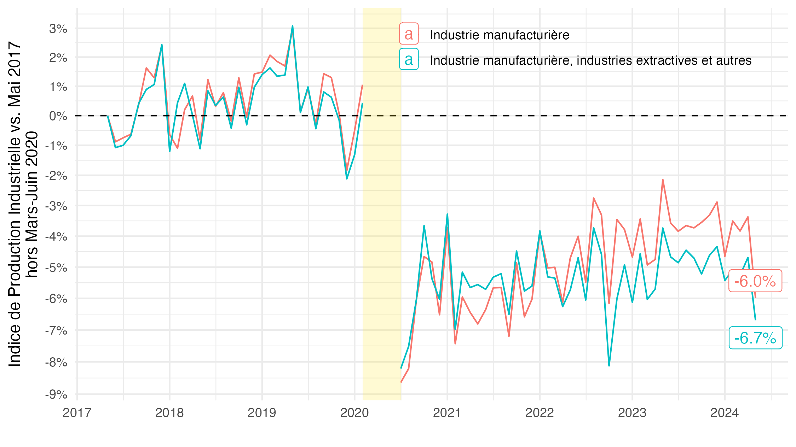
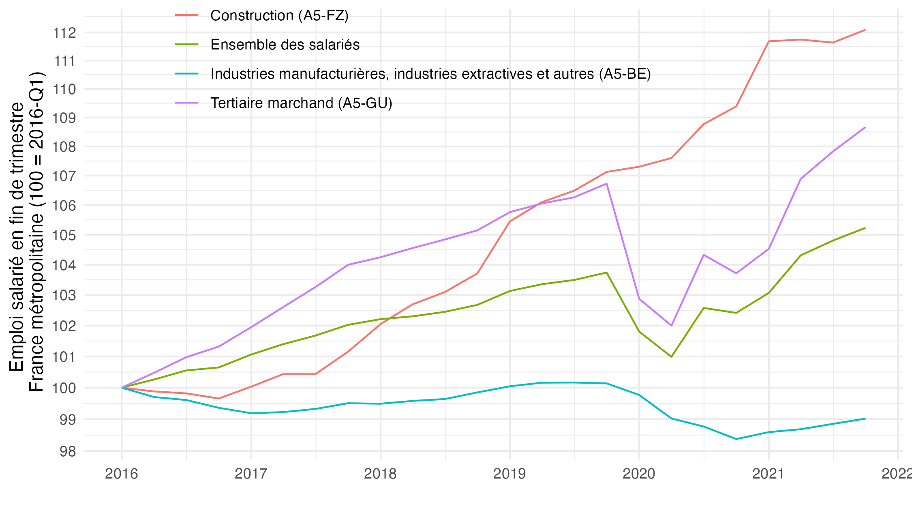
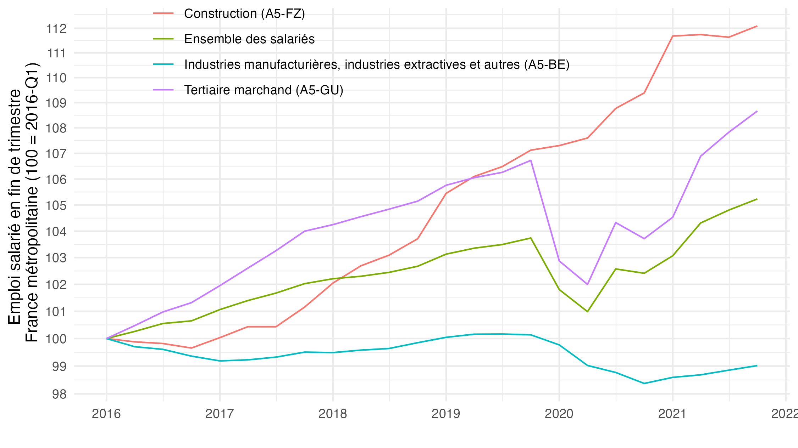
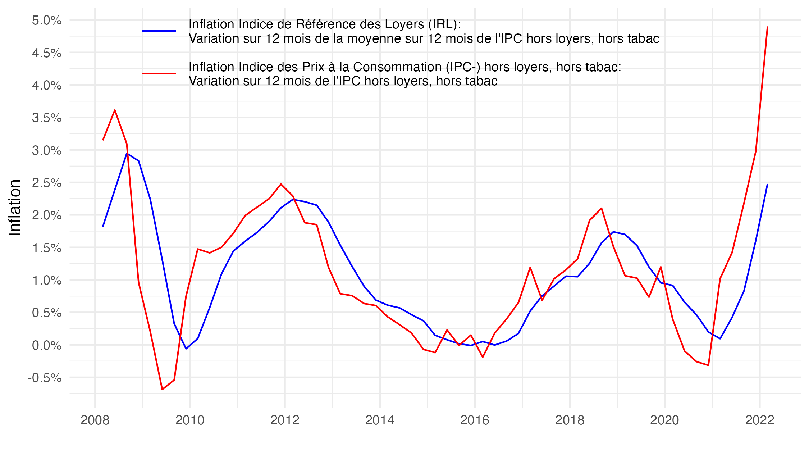

# Twitter

Répliquer quelques graphiques présentés sur le compte Twitter [@FrancoisGeerolf](https://twitter.com/FrancoisGeerolf).

Pour chaque statut de tweet n°xxx, le tweet est disponible via l'URL <https://twitter.com/FrancoisGeerolf/status/xxx>, le fichier de réplication R est xxx.R, le pdf en format pdf (vectoriel, éditable) xxx.pdf, le graphique en format png xxx.png. Me contacter si cela ne fonctionne pas, ou si vous voyez une erreur.

## Production Industrielle depuis mai 2017

## Autre exemples plus anciens

Par exemple, pour l'emploi salarié en fin de trimestre, France Métropolitaine, depuis le début du 1er mandat d'Emmanuel Macron (2ème trimestre 2017), qui est le numéro :
- Le tweet: <https://twitter.com/FrancoisGeerolf/status/1487713516127768576>
- Le fichier R: [1487713516127768576.R](1487713516127768576.R)
- Le fichier pdf: [1487713516127768576.pdf](1487713516127768576.pdf)
- Le fichier png: [1487713516127768576.png](1487713516127768576.png)

Quelques autres exemples:
 
- Exportations Nettes, % du PIB. [tweet](https://twitter.com/FrancoisGeerolf/status/1487364702841749504) / [R](1487364702841749504.R) / [png](1487364702841749504.png) / [pdf](1487364702841749504.pdf)

 
- Indice de Référence des Loyers. [tweet](https://twitter.com/FrancoisGeerolf/status/1519713704857718784) / [R](1519713704857718784.R) / [png](1519713704857718784.png) / [pdf](1519713704857718784.pdf)

