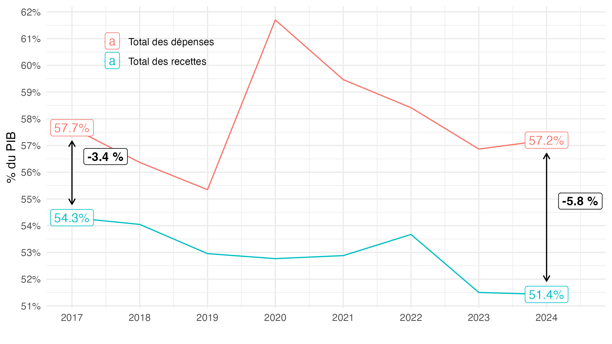
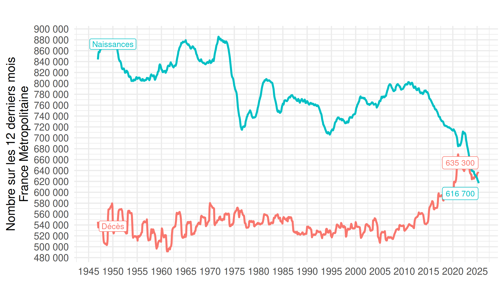
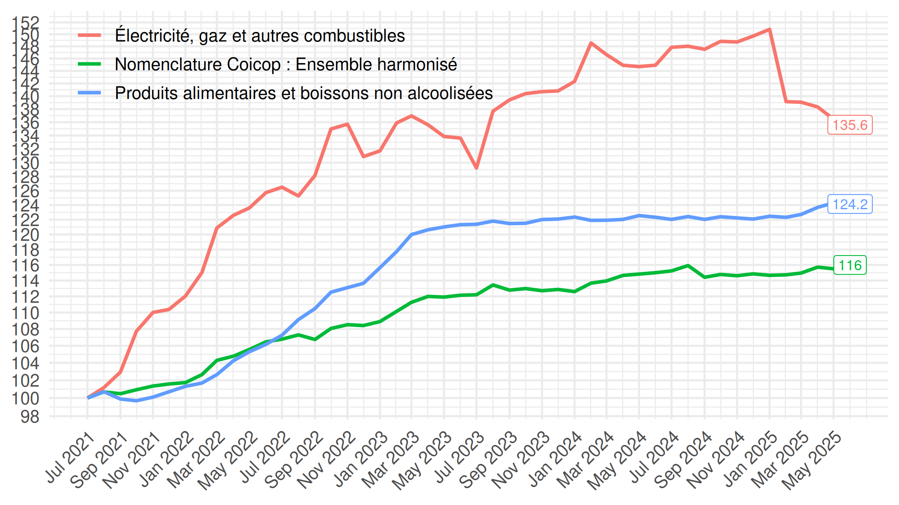
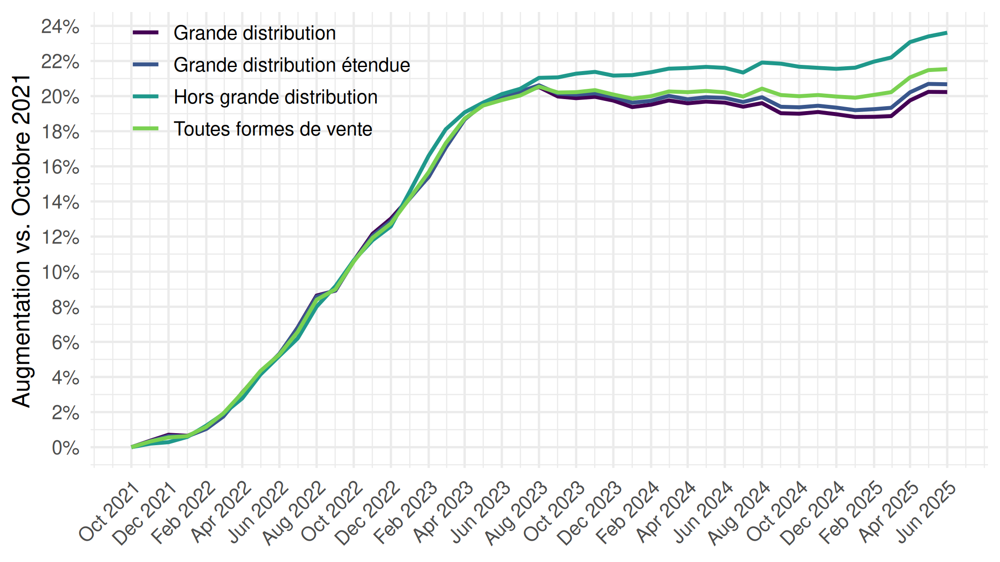
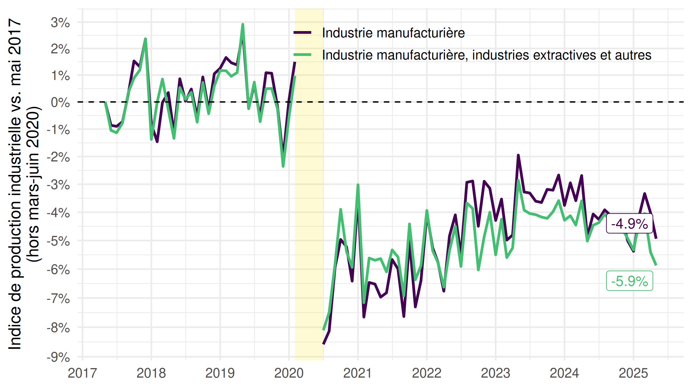
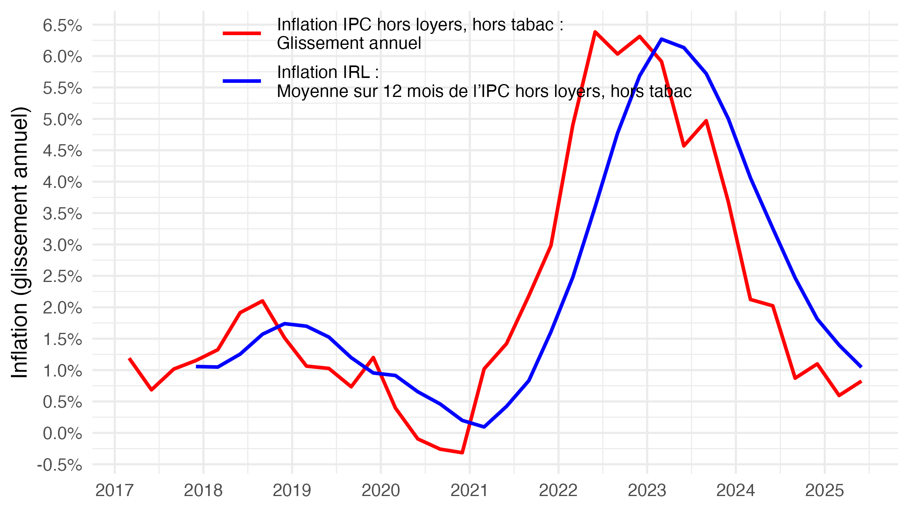
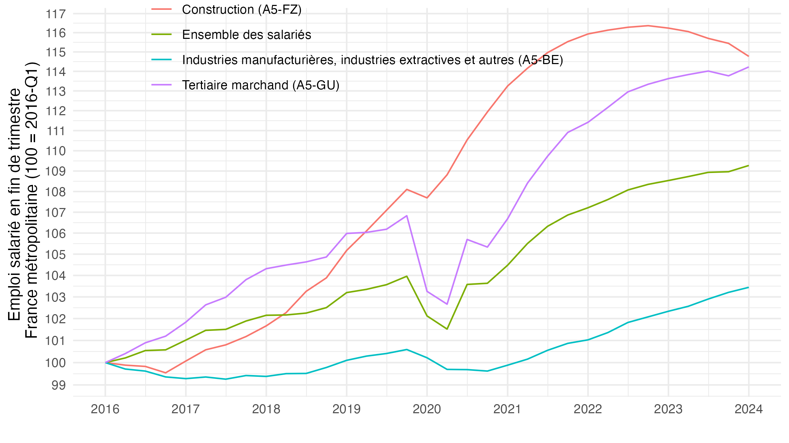

Codes permettant de répliquer plusieurs graphiques partagés sur le
compte Twitter [@FrancoisGeerolf](https://twitter.com/FrancoisGeerolf).

Chaque ligne de la table correspond à un tweet contenant :

-   le lien vers le **tweet** original,
-   une **version mise à jour du graphique** (`.png`),
-   le **code R de réplication** (`.R`),
-   la **version PDF** du graphique (`.pdf`).

Vous pouvez me contacter si un lien ne fonctionne pas, si vous constatez
une erreur, si les graphiques ne sont pas suffisamment à jour, ou si
vous souhaitez que j’ajoute d’autres graphiques.

<table>
<colgroup>
<col style="width: 4%" />
<col style="width: 89%" />
<col style="width: 2%" />
<col style="width: 3%" />
</colgroup>
<thead>
<tr>
<th style="text-align: left;">tweet</th>
<th style="text-align: left;">Graphique (mis à jour)</th>
<th style="text-align: left;">R</th>
<th style="text-align: left;">pdf</th>
</tr>
</thead>
<tbody>
<tr>
<td style="text-align: left;"><a
href="https://x.com/FrancoisGeerolf/status/_run">tweet</a></td>
<td style="text-align: left;"><strong>Définir les dimensions des
graphiques</strong> </td>
<td style="text-align: left;"><a
href="https://github.com/Francois-Geerolf/twitter/blob/main/_run.R">R</a></td>
<td style="text-align: left;"><a
href="https://github.com/Francois-Geerolf/twitter/blob/main/pdf/_run.pdf">pdf</a></td>
</tr>
<tr>
<td style="text-align: left;"><a
href="https://x.com/FrancoisGeerolf/status/1945587985228980306">tweet</a></td>
<td style="text-align: left;"><strong>Hausse du déficit depuis
2017</strong> </td>
<td style="text-align: left;"><a
href="https://github.com/Francois-Geerolf/twitter/blob/main/1945587985228980306.R">R</a></td>
<td style="text-align: left;"><a
href="https://github.com/Francois-Geerolf/twitter/blob/main/pdf/1945587985228980306.pdf">pdf</a></td>
</tr>
<tr>
<td style="text-align: left;"><a
href="https://x.com/FrancoisGeerolf/status/1879257670223573007">tweet</a></td>
<td style="text-align: left;"><strong>Naissances et décès: 627 895
naissances vs. 627 894 décès, selon l’Insee !</strong> </td>
<td style="text-align: left;"><a
href="https://github.com/Francois-Geerolf/twitter/blob/main/1879257670223573007.R">R</a></td>
<td style="text-align: left;"><a
href="https://github.com/Francois-Geerolf/twitter/blob/main/pdf/1879257670223573007.pdf">pdf</a></td>
</tr>
<tr>
<td style="text-align: left;"><a
href="https://x.com/FrancoisGeerolf/status/1832855610448048625">tweet</a></td>
<td style="text-align: left;"><strong>Inflation Juillet 2021-2024: IPCH,
énergie, alimentation</strong> </td>
<td style="text-align: left;"><a
href="https://github.com/Francois-Geerolf/twitter/blob/main/1832855610448048625.R">R</a></td>
<td style="text-align: left;"><a
href="https://github.com/Francois-Geerolf/twitter/blob/main/pdf/1832855610448048625.pdf">pdf</a></td>
</tr>
<tr>
<td style="text-align: left;"><a
href="https://x.com/FrancoisGeerolf/status/1826530570236469418">tweet</a></td>
<td style="text-align: left;"><strong>Hausse des prix dans la grande
distribution (Octobre 2021 -)</strong> </td>
<td style="text-align: left;"><a
href="https://github.com/Francois-Geerolf/twitter/blob/main/1826530570236469418.R">R</a></td>
<td style="text-align: left;"><a
href="https://github.com/Francois-Geerolf/twitter/blob/main/pdf/1826530570236469418.pdf">pdf</a></td>
</tr>
<tr>
<td style="text-align: left;"><a
href="https://x.com/FrancoisGeerolf/status/1816121032928874928">tweet</a></td>
<td style="text-align: left;"><strong>Indice de production industrielle
vs. Mai 2017</strong> </td>
<td style="text-align: left;"><a
href="https://github.com/Francois-Geerolf/twitter/blob/main/1816121032928874928.R">R</a></td>
<td style="text-align: left;"><a
href="https://github.com/Francois-Geerolf/twitter/blob/main/pdf/1816121032928874928.pdf">pdf</a></td>
</tr>
<tr>
<td style="text-align: left;"><a
href="https://x.com/FrancoisGeerolf/status/1519713704857718784">tweet</a></td>
<td style="text-align: left;"><strong>Inflation des
loyers</strong> </td>
<td style="text-align: left;"><a
href="https://github.com/Francois-Geerolf/twitter/blob/main/1519713704857718784.R">R</a></td>
<td style="text-align: left;"><a
href="https://github.com/Francois-Geerolf/twitter/blob/main/pdf/1519713704857718784.pdf">pdf</a></td>
</tr>
<tr>
<td style="text-align: left;"><a
href="https://x.com/FrancoisGeerolf/status/1487713516127768576">tweet</a></td>
<td style="text-align: left;"><strong>Emploi Trimestriel
(2016T1-)</strong> </td>
<td style="text-align: left;"><a
href="https://github.com/Francois-Geerolf/twitter/blob/main/1487713516127768576.R">R</a></td>
<td style="text-align: left;"><a
href="https://github.com/Francois-Geerolf/twitter/blob/main/pdf/1487713516127768576.pdf">pdf</a></td>
</tr>
<tr>
<td style="text-align: left;"><a
href="https://x.com/FrancoisGeerolf/status/1487364702841749504">tweet</a></td>
<td style="text-align: left;"><strong>Exportations nettes de biens,
biens industriels, biens manufacturés</strong> </td>
<td style="text-align: left;"><a
href="https://github.com/Francois-Geerolf/twitter/blob/main/1487364702841749504.R">R</a></td>
<td style="text-align: left;"><a
href="https://github.com/Francois-Geerolf/twitter/blob/main/pdf/1487364702841749504.pdf">pdf</a></td>
</tr>
</tbody>
</table>
