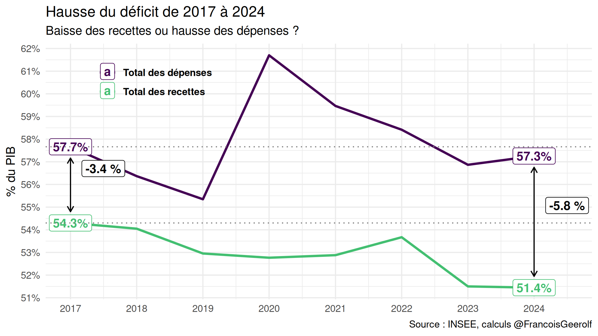
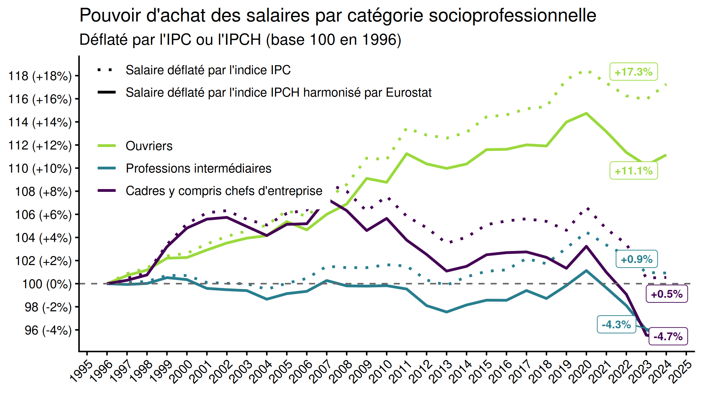
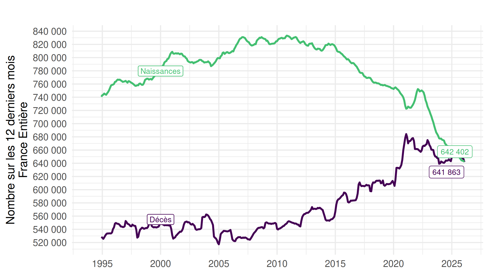
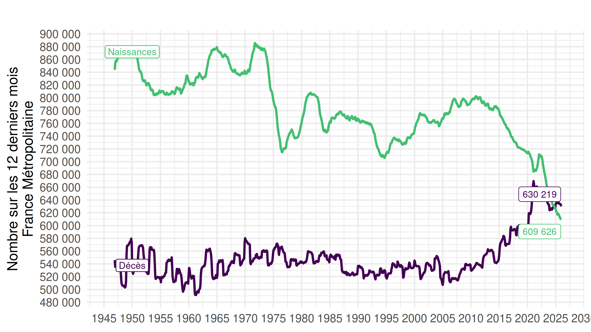
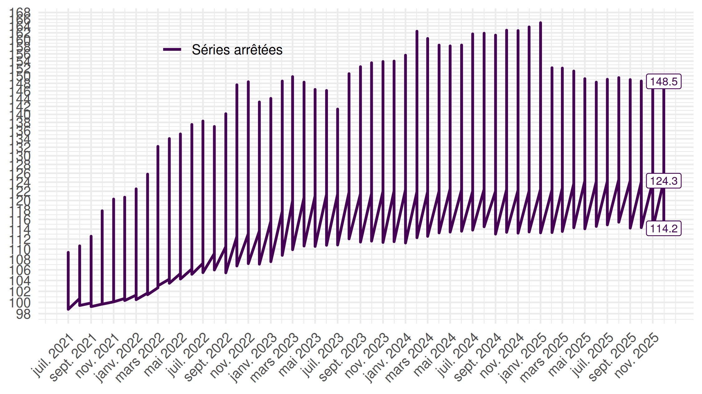
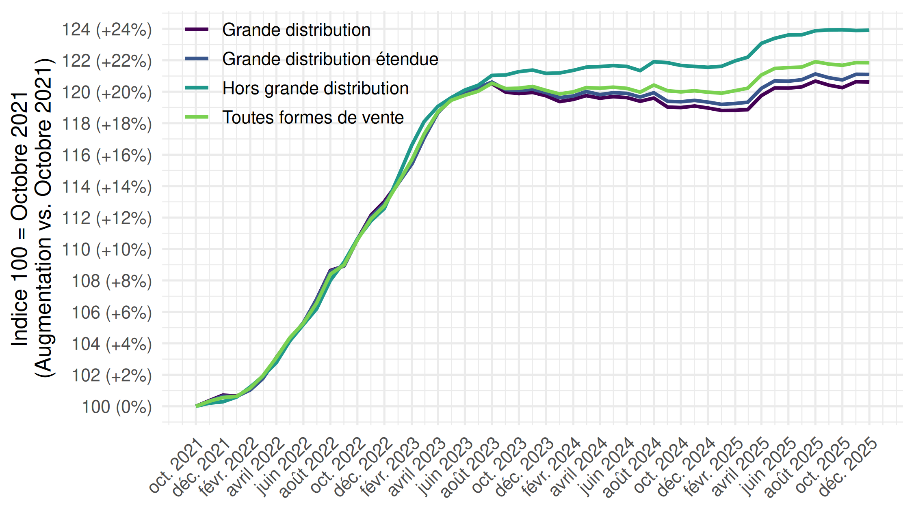
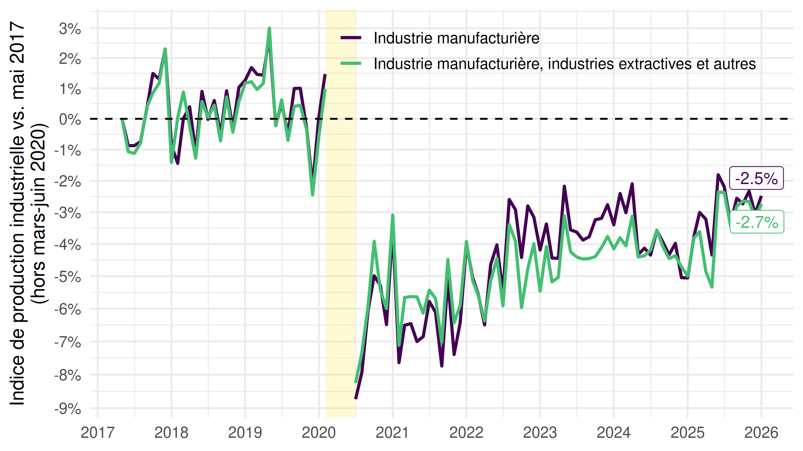
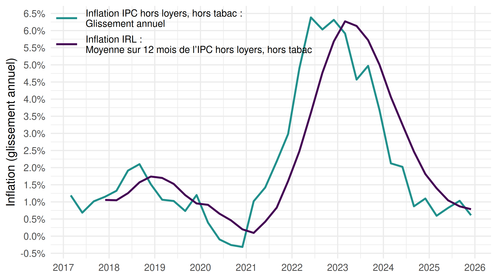
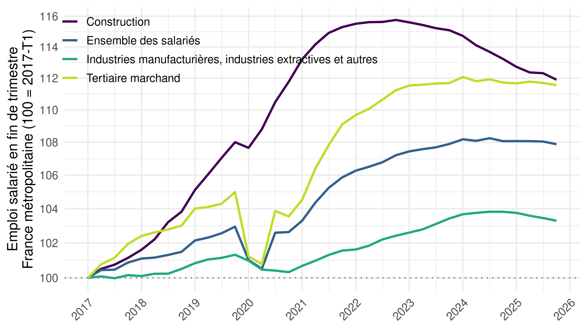
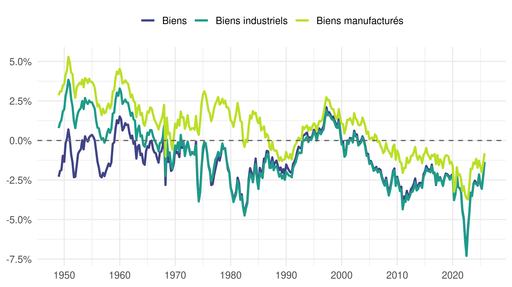

Codes permettant de répliquer plusieurs graphiques partagés sur le
compte Twitter [@FrancoisGeerolf](https://twitter.com/FrancoisGeerolf).

Chaque ligne de la table correspond à un tweet contenant :

-   le lien vers le **tweet** original,
-   une **version mise à jour du graphique** (`.png`),
-   le **code R de réplication** (`.R`),
-   la **version PDF** du graphique (`.pdf`).

Vous pouvez me contacter si un lien ne fonctionne pas, si vous constatez
une erreur, si les graphiques ne sont pas suffisamment à jour, ou si
vous souhaitez que j’ajoute d’autres graphiques.

<table>
<colgroup>
<col style="width: 3%" />
<col style="width: 91%" />
<col style="width: 1%" />
<col style="width: 2%" />
</colgroup>
<thead>
<tr class="header">
<th style="text-align: left;">tweet</th>
<th style="text-align: left;">Graphique (mis à jour)</th>
<th style="text-align: left;">R</th>
<th style="text-align: left;">pdf</th>
</tr>
</thead>
<tbody>
<tr class="odd">
<td style="text-align: left;"><a
href="https://x.com/FrancoisGeerolf/status/1945587985228980306">tweet</a></td>
<td style="text-align: left;"><strong>Hausse du déficit de 2017 à 2024:
baisse des recettes ou hausse des dépenses ?</strong> </td>
<td style="text-align: left;"><a
href="https://github.com/Francois-Geerolf/twitter/blob/main/R/1945587985228980306-deficit-recettes-depenses.R">R</a></td>
<td style="text-align: left;"><a
href="https://github.com/Francois-Geerolf/twitter/blob/main/pdf/1945587985228980306-deficit-recettes-depenses.pdf">pdf</a></td>
</tr>
<tr class="even">
<td style="text-align: left;"><a
href="https://x.com/FrancoisGeerolf/status/1938858533727916434">tweet</a></td>
<td style="text-align: left;"><strong>Baisse du salaires des cadres IPCH
vs. IPC, 1996-2023</strong> </td>
<td style="text-align: left;"><a
href="https://github.com/Francois-Geerolf/twitter/blob/main/R/1938858533727916434-salaires-1996.R">R</a></td>
<td style="text-align: left;"><a
href="https://github.com/Francois-Geerolf/twitter/blob/main/pdf/1938858533727916434-salaires-1996.pdf">pdf</a></td>
</tr>
<tr class="odd">
<td style="text-align: left;"><a
href="https://x.com/FrancoisGeerolf/status/1917855106449448963">tweet</a></td>
<td style="text-align: left;"><strong>Naissances et décès: chiffres sur
la France Entière</strong> </td>
<td style="text-align: left;"><a
href="https://github.com/Francois-Geerolf/twitter/blob/main/R/1917855106449448963-naissances-deces-FE.R">R</a></td>
<td style="text-align: left;"><a
href="https://github.com/Francois-Geerolf/twitter/blob/main/pdf/1917855106449448963-naissances-deces-FE.pdf">pdf</a></td>
</tr>
<tr class="even">
<td style="text-align: left;"><a
href="https://x.com/FrancoisGeerolf/status/1879257670223573007">tweet</a></td>
<td style="text-align: left;"><strong>Naissances et décès: 627 895
naissances vs. 627 894 décès en FM, selon l’Insee !</strong> </td>
<td style="text-align: left;"><a
href="https://github.com/Francois-Geerolf/twitter/blob/main/R/1879257670223573007-naissances-deces-FM.R">R</a></td>
<td style="text-align: left;"><a
href="https://github.com/Francois-Geerolf/twitter/blob/main/pdf/1879257670223573007-naissances-deces-FM.pdf">pdf</a></td>
</tr>
<tr class="odd">
<td style="text-align: left;"><a
href="https://x.com/FrancoisGeerolf/status/1832855610448048625">tweet</a></td>
<td style="text-align: left;"><strong>Inflation Juillet 2021-2024: IPCH,
énergie, alimentation</strong> </td>
<td style="text-align: left;"><a
href="https://github.com/Francois-Geerolf/twitter/blob/main/R/1832855610448048625-inflation-2021.R">R</a></td>
<td style="text-align: left;"><a
href="https://github.com/Francois-Geerolf/twitter/blob/main/pdf/1832855610448048625-inflation-2021.pdf">pdf</a></td>
</tr>
<tr class="even">
<td style="text-align: left;"><a
href="https://x.com/FrancoisGeerolf/status/1826530570236469418">tweet</a></td>
<td style="text-align: left;"><strong>Hausse des prix dans la grande
distribution (Octobre 2021 -)</strong> </td>
<td style="text-align: left;"><a
href="https://github.com/Francois-Geerolf/twitter/blob/main/R/1826530570236469418-grande-distribution.R">R</a></td>
<td style="text-align: left;"><a
href="https://github.com/Francois-Geerolf/twitter/blob/main/pdf/1826530570236469418-grande-distribution.pdf">pdf</a></td>
</tr>
<tr class="odd">
<td style="text-align: left;"><a
href="https://x.com/FrancoisGeerolf/status/1816121032928874928">tweet</a></td>
<td style="text-align: left;"><strong>Indice de production industrielle
vs. Mai 2017</strong> </td>
<td style="text-align: left;"><a
href="https://github.com/Francois-Geerolf/twitter/blob/main/R/1816121032928874928-IPI.R">R</a></td>
<td style="text-align: left;"><a
href="https://github.com/Francois-Geerolf/twitter/blob/main/pdf/1816121032928874928-IPI.pdf">pdf</a></td>
</tr>
<tr class="even">
<td style="text-align: left;"><a
href="https://x.com/FrancoisGeerolf/status/1519713704857718784">tweet</a></td>
<td style="text-align: left;"><strong>Inflation des
loyers</strong> </td>
<td style="text-align: left;"><a
href="https://github.com/Francois-Geerolf/twitter/blob/main/R/1519713704857718784-inflation-loyers.R">R</a></td>
<td style="text-align: left;"><a
href="https://github.com/Francois-Geerolf/twitter/blob/main/pdf/1519713704857718784-inflation-loyers.pdf">pdf</a></td>
</tr>
<tr class="odd">
<td style="text-align: left;"><a
href="https://x.com/FrancoisGeerolf/status/1487713516127768576">tweet</a></td>
<td style="text-align: left;"><strong>Emploi Trimestriel
(2016T1-)</strong> </td>
<td style="text-align: left;"><a
href="https://github.com/Francois-Geerolf/twitter/blob/main/R/1487713516127768576-emploi-trimestriel.R">R</a></td>
<td style="text-align: left;"><a
href="https://github.com/Francois-Geerolf/twitter/blob/main/pdf/1487713516127768576-emploi-trimestriel.pdf">pdf</a></td>
</tr>
<tr class="even">
<td style="text-align: left;"><a
href="https://x.com/FrancoisGeerolf/status/1487364702841749504">tweet</a></td>
<td style="text-align: left;"><strong>Exportations nettes de biens,
biens industriels, biens manufacturés</strong> </td>
<td style="text-align: left;"><a
href="https://github.com/Francois-Geerolf/twitter/blob/main/R/1487364702841749504-exportations-nettes.R">R</a></td>
<td style="text-align: left;"><a
href="https://github.com/Francois-Geerolf/twitter/blob/main/pdf/1487364702841749504-exportations-nettes.pdf">pdf</a></td>
</tr>
</tbody>
</table>
