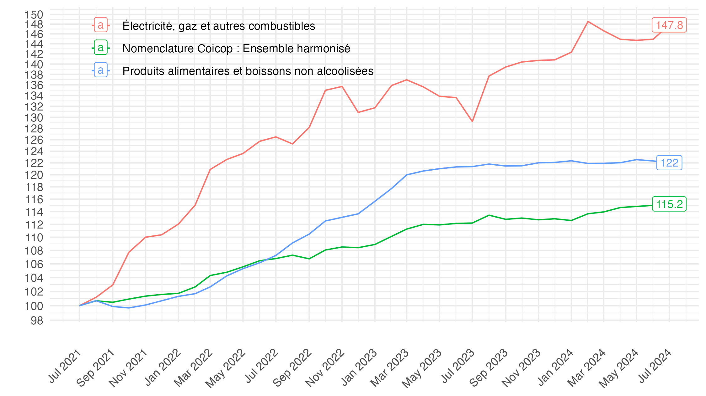
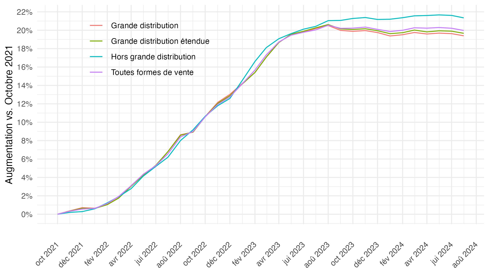

Codes pour répliquer quelques graphiques présentés sur le compte Twitter
[@FrancoisGeerolf](https://twitter.com/FrancoisGeerolf).

Pour chaque statut de tweet n°xxx: - le tweet (et le graphique original)
est disponible via l’URL
<https://twitter.com/FrancoisGeerolf/status/xxx> - le fichier de
réplication R est xxx.R - le pdf en format pdf (vectoriel, éditable)
xxx.pdf - le graphique en format png xxx.png.

Me contacter si cela ne fonctionne pas, si vous voyez une erreur, ou
pour que j’ajoute le code d’autres graphiques.

## Liste complète

<table>
<colgroup>
<col style="width: 57%" />
<col style="width: 5%" />
<col style="width: 2%" />
<col style="width: 3%" />
<col style="width: 3%" />
<col style="width: 27%" />
</colgroup>
<thead>
<tr class="header">
<th style="text-align: left;">Titre</th>
<th style="text-align: left;">tweet</th>
<th style="text-align: left;">R</th>
<th style="text-align: left;">png</th>
<th style="text-align: left;">pdf</th>
<th style="text-align: left;">image</th>
</tr>
</thead>
<tbody>
<tr class="odd">
<td style="text-align: left;">Inflation Juillet 2021-2024: IPCH,
énergie, alimentation</td>
<td style="text-align: left;"><a
href="https://twitter.com/FrancoisGeerolf/status/1832855610448048625">tweet</a></td>
<td style="text-align: left;"><a
href="https://github.com/Francois-Geerolf/twitter/blob/main/1832855610448048625.R">R</a></td>
<td style="text-align: left;"><a
href="https://github.com/Francois-Geerolf/twitter/blob/main/1832855610448048625.png">png</a></td>
<td style="text-align: left;"><a
href="https://github.com/Francois-Geerolf/twitter/blob/main/1832855610448048625.pdf">pdf</a></td>
<td style="text-align: left;"></td>
</tr>
<tr class="even">
<td style="text-align: left;">Hausse des prix dans la grande
distribution (Octobre 2021 -)</td>
<td style="text-align: left;"><a
href="https://twitter.com/FrancoisGeerolf/status/1826530570236469418">tweet</a></td>
<td style="text-align: left;"><a
href="https://github.com/Francois-Geerolf/twitter/blob/main/1826530570236469418.R">R</a></td>
<td style="text-align: left;"><a
href="https://github.com/Francois-Geerolf/twitter/blob/main/1826530570236469418.png">png</a></td>
<td style="text-align: left;"><a
href="https://github.com/Francois-Geerolf/twitter/blob/main/1826530570236469418.pdf">pdf</a></td>
<td style="text-align: left;"></td>
</tr>
<tr class="odd">
<td style="text-align: left;">Indice de production industrielle vs. Mai
2017</td>
<td style="text-align: left;"><a
href="https://twitter.com/FrancoisGeerolf/status/1816121032928874928">tweet</a></td>
<td style="text-align: left;"><a
href="https://github.com/Francois-Geerolf/twitter/blob/main/1816121032928874928.R">R</a></td>
<td style="text-align: left;"><a
href="https://github.com/Francois-Geerolf/twitter/blob/main/1816121032928874928.png">png</a></td>
<td style="text-align: left;"><a
href="https://github.com/Francois-Geerolf/twitter/blob/main/1816121032928874928.pdf">pdf</a></td>
<td style="text-align: left;"></td>
</tr>
<tr class="even">
<td style="text-align: left;">Inflation des loyers</td>
<td style="text-align: left;"><a
href="https://twitter.com/FrancoisGeerolf/status/1519713704857718784">tweet</a></td>
<td style="text-align: left;"><a
href="https://github.com/Francois-Geerolf/twitter/blob/main/1519713704857718784.R">R</a></td>
<td style="text-align: left;"><a
href="https://github.com/Francois-Geerolf/twitter/blob/main/1519713704857718784.png">png</a></td>
<td style="text-align: left;"><a
href="https://github.com/Francois-Geerolf/twitter/blob/main/1519713704857718784.pdf">pdf</a></td>
<td style="text-align: left;"></td>
</tr>
<tr class="odd">
<td style="text-align: left;">Emploi Trimestriel (2016T1-)</td>
<td style="text-align: left;"><a
href="https://twitter.com/FrancoisGeerolf/status/1487713516127768576">tweet</a></td>
<td style="text-align: left;"><a
href="https://github.com/Francois-Geerolf/twitter/blob/main/1487713516127768576.R">R</a></td>
<td style="text-align: left;"><a
href="https://github.com/Francois-Geerolf/twitter/blob/main/1487713516127768576.png">png</a></td>
<td style="text-align: left;"><a
href="https://github.com/Francois-Geerolf/twitter/blob/main/1487713516127768576.pdf">pdf</a></td>
<td style="text-align: left;"></td>
</tr>
<tr class="even">
<td style="text-align: left;">Exportations nettes (% du PIB)</td>
<td style="text-align: left;"><a
href="https://twitter.com/FrancoisGeerolf/status/1487364702841749504">tweet</a></td>
<td style="text-align: left;"><a
href="https://github.com/Francois-Geerolf/twitter/blob/main/1487364702841749504.R">R</a></td>
<td style="text-align: left;"><a
href="https://github.com/Francois-Geerolf/twitter/blob/main/1487364702841749504.png">png</a></td>
<td style="text-align: left;"><a
href="https://github.com/Francois-Geerolf/twitter/blob/main/1487364702841749504.pdf">pdf</a></td>
<td style="text-align: left;"></td>
</tr>
</tbody>
</table>

## Quelques exemples récents

### Inflation Juillet 2021-2024: Ensemble IPCH, Energie de la maison, Alimentation

### Indice des prix dans la grande distribution depuis octobre 2021

[Tweet](https://x.com/FrancoisGeerolf/status/1826530570236469418)

### Production Industrielle depuis mai 2017

## Quelques exemples plus anciens

### Emploi salarié en fin de trimestre

### Exportations Nettes, % du PIB

[tweet](https://twitter.com/FrancoisGeerolf/status/1487364702841749504)
/ [R](1487364702841749504.R) / [png](1487364702841749504.png) /
[pdf](1487364702841749504.pdf)

### Indice de Référence des Loyers

[tweet](https://twitter.com/FrancoisGeerolf/status/1519713704857718784)
/ [R](1519713704857718784.R) / [png](1519713704857718784.png) /
[pdf](1519713704857718784.pdf)

